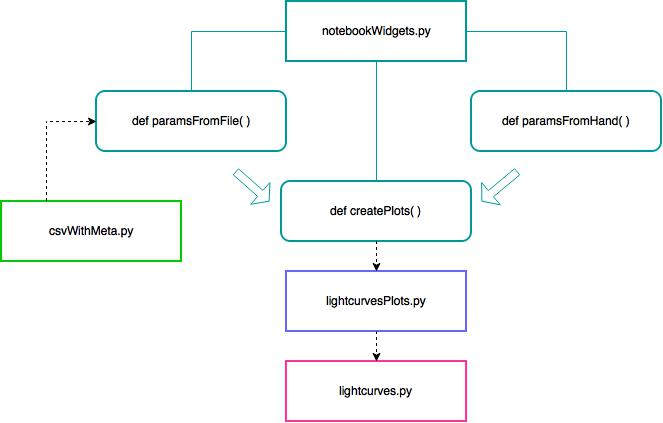

# LightCurvesForSeeChange

## About

Light Curves for Type Ia, Type Ib/c and Type II supernovae generated using [SNCosmo](https://sncosmo.readthedocs.org/).
Data points are added to the plots either manually by changing the code in `notebookWidgets.paramsFromHand()` or through a csv-like file exemplified by `test.csv`

**Dependencies:**

- astropy
- sncosmo
... and the usual numpy/scipy/mpl business.

**Scripts:**

- `csvWithMeta.py`: Takes input csv-like file and returs two dictionaries. One dictionary is the metadata. The other is a nested dictionary. The inner layer has `flux`, `flux_error` and `time` as keys and the outer layer has filters as keys. Note that `time = MJD - MJD[0]`

- `lightcurves.py`: Returns a dictionary with an array of phases and it's corresponding array of observed flux.   
- `lightcurvesPlots.py`: Generates Light Curve plots using matplotlib and seaborn.   
- `notebookWidgets.py`: Optains parameters for the widgets that will be displayed in the IPython notebook, then calls the interact function. 
